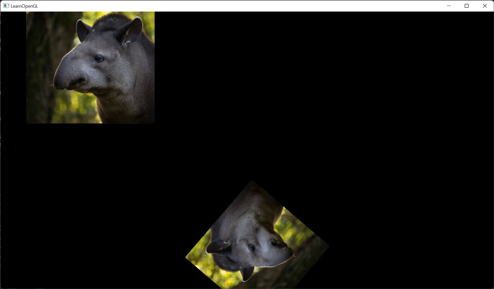

# My OpenGL learning code

This project uses GLFW, HandmadeMath and stbt_image.h to show moving images of a Tapir.

## Problems

The application stutters when in windowed mode, but works well in full-screen (windowed full-screen not tested yet).
Strangely the stuttering goes away, when the window is maximized in windowed mode. As soon as the size of the window
is changed, it stutters again. It also stutters when started with every other dimension that's not maximized.

## Resources

https://github.com/nothings/single_file_libs
https://github.com/mackron/miniaudio
https://github.com/memononen/nanovg
https://hg.sr.ht/~duangle/oui-blendish
https://github.com/floooh/sokol
https://github.com/Celtoys/Remotery
https://github.com/mattiasgustavsson/libs/blob/main/docs/hashtable.md
